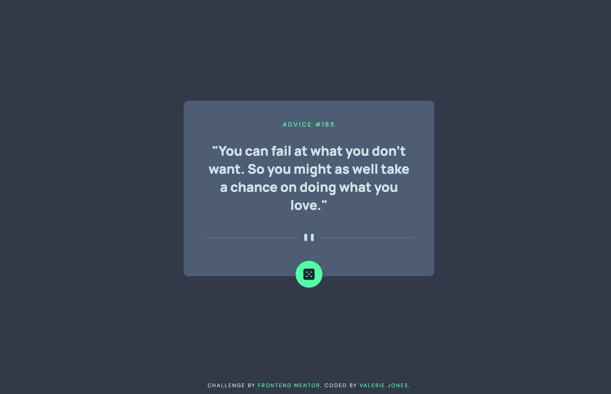

# Frontend Mentor - Advice generator app solution

This is a solution to the [Advice generator app challenge on Frontend Mentor](https://www.frontendmentor.io/challenges/advice-generator-app-QdUG-13db). Frontend Mentor challenges help you improve your coding skills by building realistic projects.

## Table of contents

- [Overview](#overview)
  - [The challenge](#the-challenge)
  - [Screenshot](#screenshot)
  - [Links](#links)
- [My process](#my-process)
  - [Built with](#built-with)
  - [Code Snippets](#code-snippets)
  - [Continued development](#continued-development)
- [Author](#author)

## Overview

### The challenge

Users should be able to:

- View the optimal layout for the app depending on their device's screen size
- See hover states for all interactive elements on the page
- Generate a new piece of advice by clicking the dice icon

### Screenshot



### Links

- Solution URL: [https://github.com/vljones133/advice-generator](https://github.com/vljones133/advice-generator)
- Live Site URL: [https://advice-generator-vjonesdev.vercel.app](https://advice-generator-vjonesdev.vercel.app)

## My process

### Built with

- Semantic HTML5 markup
- CSS custom properties
- Flexbox
- Mobile-first workflow
- [React](https://reactjs.org/) - JS library

### To be continued...

- [TypeScript](https://www.typescriptlang.org/) - JS with syntax for types
- [Testing](https://jestjs.io/) - JS testing framework
- [SASS](https://sass-lang.com/) - CSS extension language

### Code Snippets

```css
.spin {
  animation: spin 1s linear;
}

@keyframes spin {
  from {
    transform: rotate(0deg);
  }
  to {
    transform: rotate(360deg);
  }
}
```

```js
  <picture>
      <source srcSet={pauseMobile} media='(max-width: 575px)' />
      
  </picture>
  <button
     className={clicked ? "spin" : ""}
     onClick={fetchAdviceAndSpin}
  >
     
  </button>
```

### Continued development

I plan to convert to SASS, implement a little testing, and as much TypeScript as I can into the project for more practice on these newly learned concepts.

## Author

- Website - [Valerie Jones' Portfolio](http://vjones.dev)
- Frontend Mentor - [@VLJones133](https://www.frontendmentor.io/profile/vljones133)
- Twitter - [@ValJonesDev](https://twitter.com/ValJonesDev)
- LinkedIn - [@ValerieJones133](https://linkedin.com/in/valeriejones133)
